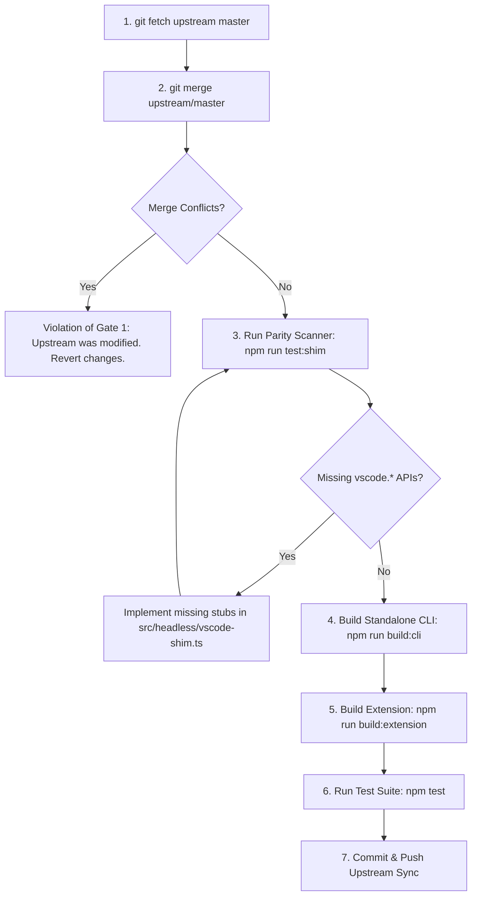

# Workflow Rules & Compliance Standards: `iris-sync`

## 1. Governance & Authority

This document defines the binding architectural rules, compliance gates, and workflow protocols for the `iris-sync` headless compiler and runtime subsystem in the [`vscode-objectscript`](../) repository.

All automated coding agents, continuous integration (CI) workflows, and human contributors must strictly comply with these rules. Pull requests violating any non-negotiable gate will be blocked automatically.

---

## 2. Invariant Rules & Pre-Commit Gates

### Gate 1: Upstream Source Isolation Invariant (Pattern A)
- **Severity**: **FATAL / BLOCKING**
- **Statement**: Upstream source files are **READ-ONLY**. Under no circumstances may any file within the upstream extension codebase be edited, refactored, or reformatted.
- **Protected Upstream Paths**:
  - [`src/api/**`](../src/api/)
  - [`src/commands/**`](../src/commands/)
  - [`src/utils/**`](../src/utils/)
  - [`src/providers/**`](../src/providers/)
  - [`src/debug/**`](../src/debug/)
  - [`src/explorer/**`](../src/explorer/)
  - [`src/extension.ts`](../src/extension.ts)
  - [`src/languageConfiguration.ts`](../src/languageConfiguration.ts)
  - [`src/web-extension.ts`](../src/web-extension.ts)
- **Permitted Headless Development Paths**:
  - [`src/headless/**`](../src/headless/) (CLI logic, shims, bridge, logger)
  - [`build/**`](../build/) (esbuild bundlers)
  - [`test/**`](../test/) (shim and parity tests)
  - [`schemas/**`](../schemas/) (JSON Schema definitions)
  - [`bin/**`](../bin/) (compiled binary)
  - [`docs/**`](../docs/) (documentation and guides)
  - [`.agents/**`](../.agents/) and [`.workflows/**`](../.workflows/)
- **Automated Verification**:
  ```bash
  # Must produce zero output (no files modified outside allowed directories)
  git diff --name-only origin/master...HEAD | grep -v -E '^(src/headless|build|test|schemas|bin|docs|\.agents|\.workflows|package.*|tsconfig.*|\.gitignore)'
  ```

---

### Gate 2: Dual-Target Build & Tree-Shaking Invariant
- **Severity**: **FATAL / BLOCKING**
- **Statement**: Both extension and CLI build targets must compile cleanly without errors or circular dependency loops.
- **Verification Commands**:
  ```bash
  npm run build:cli        # Compiles bin/iris-sync.js via esbuild
  npm run build:extension  # Compiles dist/extension.js via webpack
  ```
- **Tree-Shaking Rule**:
  The CLI build script ([`build/esbuild.cli.ts`](../build/esbuild.cli.ts)) must map `"vscode"` to [`src/headless/vscode-shim.ts`](../src/headless/vscode-shim.ts). The resulting binary must not contain editor webviews, debugger engines, or textmate syntaxes.

---

### Gate 3: 100% AST Contract Parity Rule
- **Severity**: **FATAL / BLOCKING**
- **Statement**: Every `vscode.*` API property or method invoked across upstream source code must be present in [`src/headless/vscode-shim.ts`](../src/headless/vscode-shim.ts).
- **Verification Command**:
  ```bash
  npm run test:shim
  ```
- **Compliance Criteria**:
  The static AST scanner in [`test/shim.test.ts`](../test/shim.test.ts) must report 100% coverage with zero missing symbols. If an upstream update introduces new `vscode.*` calls, corresponding headless implementations must be added to `vscode-shim.ts` before merging.

---

### Gate 4: Non-Destructive Configuration Handling (JSONC Safe)
- **Severity**: **HIGH / REJECTION RISK**
- **Statement**: All parsers and formatters handling user configuration ([`.vscode/settings.json`](../.vscode/settings.json), [`.iris-sync/config.json`](../.iris-sync/config.json), [`.iris-sync/servers.json`](../.iris-sync/servers.json)) must handle JSONC (comments and trailing commas) without throwing or corrupting developer annotations.
- **Implementation Rules**:
  - Always use [`stripJsonc()`](../src/headless/configBridge.ts) and [`parseJsoncSafe()`](../src/headless/configBridge.ts).
  - When mutating `.vscode/settings.json`, always use [`setSettingPreservingJsonc()`](../src/headless/configBridge.ts) to surgically update settings without destroying existing comments or trailing commas.
  - Never overwrite configuration files with raw `JSON.stringify()` on parsed objects.
  - Modifications to `.vscode/settings.json` must be surgical: preserve existing non-target properties and avoid overwriting user comments.

---

### Gate 5: Authoritative Document Name Resolution
- **Severity**: **HIGH / REJECTION RISK**
- **Statement**: Document names sent to IRIS Atelier REST endpoints must follow strict authority precedence rather than raw disk paths.
- **Resolution Precedence**:
  1. **Classes (`.cls`)**:
     Header definition statement takes absolute authority:
     `^[ \t]*Class[ \t]+(%?[\p{L}\d_\u{100}-\u{ffff}]+(?:\.[\p{L}\d_\u{100}-\u{ffff}]+)*)`
     *Example*: `src/some/folder/Order_Worker.cls` containing `Class App.Backend.Order_Worker` resolves to `App.Backend.Order_Worker.cls`.
     *Note*: Supports unicode letters, digits, package dot hierarchy, `%` prefix, and underscores `_`.
  2. **Routines (`.mac`, `.int`, `.inc`)**:
     Header routine statement takes authority:
     `^ROUTINE[ \t]+([^\s\[]+)`
  3. **Path Fallback & Category Folder Normalization**:
     If no header is present, path relative to `sourceRoot` is converted using dot notation (`.` instead of `/`). Leading category directories (`cls/` for classes, and `mac/`, `inc/`, `routines/`, `rtn/` for routines/includes) are automatically stripped.
     *Example*: `src/cls/MyPkg/MyClass.cls` $\rightarrow$ `MyPkg.MyClass.cls`.
     *Example*: `src/routines/myRoutine.mac` $\rightarrow$ `myRoutine.mac`.

---

## 3. Concurrency & Atelier REST Protocol Rules

### 3.1 Optimistic Concurrency Control
1. **Timestamp Anchoring**: Every document upload (`PUT /api/atelier/v1/{ns}/doc/{docName}`) must default to `ignoreConflict=0` and provide the cached server timestamp via header:
   ```http
   IF-NONE-MATCH: <serverTs>
   ```
2. **Handling `HTTP 409 Conflict`**:
   When the server copy is newer than the local cached baseline, the API responds with `409 Conflict`.
3. **Deterministic Conflict Policies**:
   In headless/CI contexts, interactive prompts are forbidden. The runtime must evaluate `--conflict` policy:
   - `fail` (Default in automated environments): Abort operation, report conflict on stderr, exit with status `2`.
   - `overwrite`: Re-issue PUT with `ignoreConflict=1` (`--force`).
   - `pull`: Fetch remote document with `format=udl` and update local disk file.
   - `diff`: Output colored unified diff comparing server copy to local file without modifying either.
   - `merge`: Perform 3-way merge against cached baseline.

### 3.2 Storage Echo Suppression Rule
1. **The Bounce Loop Problem**: IRIS compiler modifies the class `<Storage>` XML block and returns it. Upstream `updateStorage()` writes this block back into the disk file. Naive watchers re-detect this disk write and re-trigger compilation indefinitely.
2. **Mandatory AST Hashing**:
   Before triggering an upload on watcher events, calculate the semantic hash using [`computeSemanticHash()`](../src/headless/cli.ts):
   $$\text{Hash}_{\text{semantic}} = \text{SHA256}(\text{FileContent} \setminus \text{StorageBlock})$$
3. If the semantic hash has not changed, the change is classified as a **Compiler Echo** and must be suppressed.

---

## 4. Coexistence with Active VS Code Instances

When running `iris-sync` in environments where developers simultaneously have VS Code open:
1. **Watcher Collision Hazard**: Both VS Code's `vscode-objectscript` watcher and `iris-sync` watcher detect external writes and fire concurrent PUT requests, causing race conditions and 409 conflicts.
2. **Coexistence Protocol**:
   The setting `objectscript.syncLocalChanges` in [`.vscode/settings.json`](../.vscode/settings.json) must be tuned to `"vscodeOnly"`:
   ```json
   {
     "objectscript.syncLocalChanges": "vscodeOnly"
   }
   ```
3. **Division of Responsibility**:
   - **VS Code**: Synchronizes only files actively edited and saved within editor buffers.
   - **`iris-sync`**: Synchronizes all external filesystem mutations (AI agent modifications, terminal scripts, Git branch switches).

---

## 5. Atomic Git Synchronization Protocol (`git-sync`)

During Git operations (`checkout`, `pull`, `merge`, `rebase`), naive per-file watchers crash the IRIS Web Gateway and leave obsolete server artifacts.
All automated pipelines and Git hooks must utilize `iris-sync git-sync`:

```bash
iris-sync git-sync --from HEAD@{1} --to HEAD
```

### 5.1 Protocol Execution Pipeline
1. **Diff Classification**:
   Executes `git diff --name-status <from> <to> -- <sourceRoot>`.
   - `D` (and old path in `R`): Added to Purge Queue.
   - `A` / `M` (and new path in `R`): Added to Upload Queue.
2. **Server Purge Phase**:
   Iterates through deleted classes/routines and purges them from the IRIS namespace using `api.deleteDoc(docName)`.
3. **Batch Upload Phase**:
   Uploads all modified and added files with `ignoreConflict=1` (Git state is authoritative).
4. **Topological Compilation Phase**:
   Compiles classes in topological dependency order (parents before subclasses) or issues single batch `actionCompile` payloads.

---

## 6. Zero-Conflict Upstream Maintenance Workflow

To pull upstream releases and maintain zero Git merge debt:



### Step-by-Step Instructions:
1. **Fetch Upstream**:
   ```bash
   git fetch upstream master
   ```
2. **Merge Upstream**:
   ```bash
   git merge upstream/master
   ```
   *Note: Because Gate 1 prohibits modifying upstream files, this merge completes cleanly without conflicts.*
3. **Scan AST Parity**:
   ```bash
   npm run test:shim
   ```
   If newly introduced `vscode.*` calls appear in upstream files, add the missing methods to [`src/headless/vscode-shim.ts`](../src/headless/vscode-shim.ts).
4. **Compile & Verify**:
   ```bash
   npm run build:cli
   npm run build:extension
   ./bin/iris-sync.js --help
   ```

---

## 7. Contributor Pre-Flight Checklist

Before submitting any commit or opening a pull request, ensure every item is verified:

- [ ] **No Upstream Changes**: Zero modified files in `src/api/`, `src/commands/`, `src/utils/`, `src/extension.ts`.
- [ ] **Builds Pass**: `npm run build:cli` and `npm run build:extension` exit with code 0.
- [ ] **Parity Verified**: `npm run test:shim` passes 100% of checks across all upstream files.
- [ ] **Document Name Authority**: Class header regex extraction takes priority over file path, correctly matching underscores, unicode, and package segments.
- [ ] **Category Stripping Verified**: Category folders (`cls/`, `mac/`, `inc/`, `routines/`, `rtn/`) are stripped on fallback.
- [ ] **Safe JSONC**: No raw `JSON.parse` or comment-wiping `JSON.stringify` calls on user configuration files; surgical updates via `setSettingPreservingJsonc`.
- [ ] **Concurrency Safe**: `ignoreConflict=0` with `IF-NONE-MATCH` header implemented on uploads.
- [ ] **Storage Echo Suppressed**: Semantic AST hashing excludes `<Storage>` block.
- [ ] **Git-Sync Ready**: `git-sync` correctly purges deleted classes and batches uploads.
