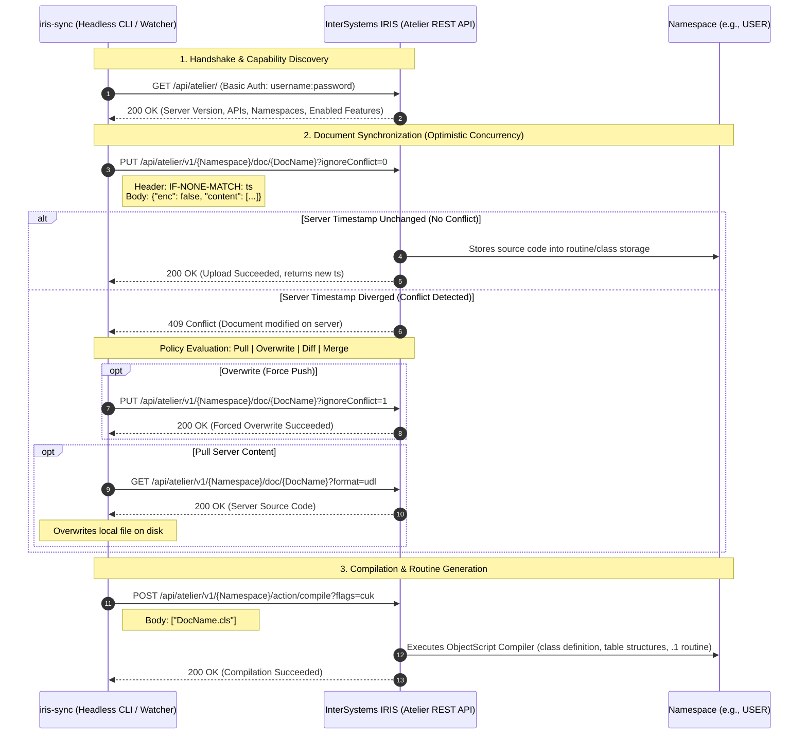
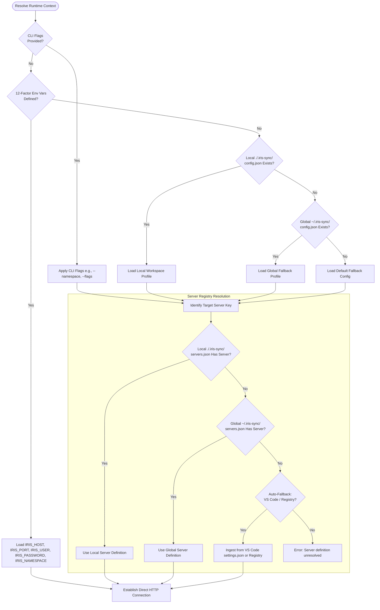
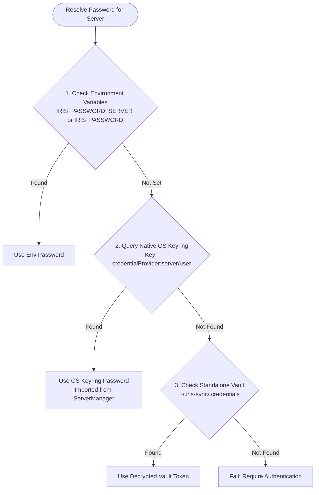
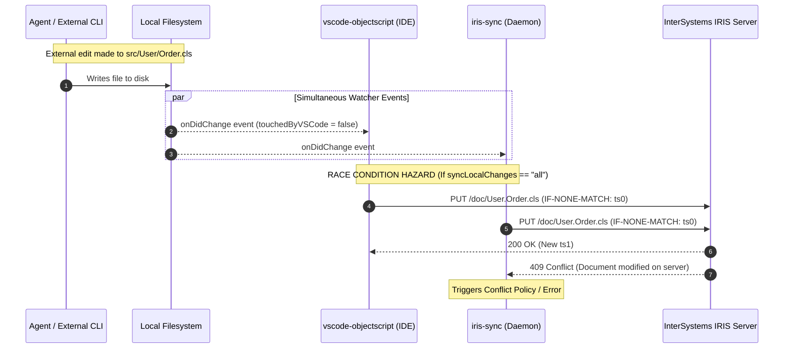

# Headless InterSystems IRIS Synchronization & Compilation Tool (`iris-sync`)

## Architectural Blueprint, Reverse-Engineering Guide & Standalone Utility Manual

---

## 1. Executive Summary & Problem Statement

### 1.1 The Problem

In modern InterSystems IRIS development, engineers commonly write ObjectScript code (`.cls`, `.mac`, `.inc`) in VS Code-compatible IDEs (such as VS Code, VSCodium, or Antigravity IDE) using the official [`intersystems-community/vscode-objectscript`](https://github.com/intersystems-community/vscode-objectscript) extension.

While this workflow works well interactively, it has major structural limitations:

- **Active IDE Process Dependency**: Synchronization and compilation mechanisms depend entirely on an actively running VS Code / Antigravity IDE process to execute the extension's workspace file watcher (`vscode.workspace.createFileSystemWatcher`). The IDE must remain open to detect and process filesystem modifications.
- **Headless Inoperability**: In headless environments (e.g., CI/CD pipelines, containerized build environments, remote terminal sessions, or when the IDE is closed), no IDE watcher is running. External modifications (such as Git branch switches, CLI scripts, or autonomous AI agent edits) remain unsynchronized with the IRIS server.
- **Resource Inefficiency**: Running a full Electron-based IDE permanently solely to maintain a filesystem watcher consumes excessive memory and CPU, and is structurally inapplicable to headless automation.

### 1.2 The Vision: Standalone `iris-sync` / `iris-daemon`

A standalone, lightweight, headless CLI utility and background daemon that:

1. Monitors configurable filesystem directories (defaulting to `src/` e.g., `src/**/*.{cls,mac,inc}`) using high-performance file-system watchers (`chokidar` or `watchdog`).
2. Resolves local filesystem documents to authoritative IRIS document identifiers, extracting the class name directly from the internal `Class Package.Class` definition header for `.cls` files (e.g., `src/MyApp/BS/OrderService.cls` containing `Class MyApp.BS.OrderService` $\rightarrow$ `MyApp.BS.OrderService.cls`), with path-based normalization for routines and include files.
3. Communicates directly with the **InterSystems IRIS Atelier REST API** (ports 57772, 52773) over HTTP/HTTPS.
4. Uploads document content (`PUT /doc/{docName}`) and executes compiler actions (`POST /action/compile?flags=cuk`).
5. Decouples configuration from VS Code UI via a two-tier global/local architecture (`.iris-sync/config.json`, `.iris-sync/servers.json`), supporting 12-factor environment variables, automated Windows Registry server extraction, and VS Code user/workspace settings ingestion.

### 1.3 Architectural Delivery Model: Fork + Headless CLI Layer (Pattern A)

Rather than building a greenfield tool from scratch (which risks protocol divergence, missing edge cases, and continuous maintenance lag) or an invasive core refactoring (Pattern B, which induces severe Git merge conflicts on future upstream updates), `iris-sync` implements **Pattern A: Virtual Runtime Shim**:

- **Upstream Codebase Reuse**: Directly leverages the official, battle-tested [`intersystems-community/vscode-objectscript`](https://github.com/intersystems-community/vscode-objectscript) repository as a fork.
- **Zero Upstream Modifications**: Upstream source code (including `AtelierAPI`, `importFile()`, `loadChanges()`, `updateStorage()`, and `documentIndex`) remains 100% untouched.
- **Build-Time Module Aliasing**: The `vscode` module import (`from "vscode"`), present across 52 upstream files, is aliased at build time via `esbuild --alias:vscode=./src/headless/vscode-shim.ts` to a virtual headless shim implementing `workspace`, `window`, `Uri`, and `workspaceState`.
- **Zero Merge Conflicts**: Future upstream releases and bugfixes are integrated via standard Git remotes (`git fetch upstream && git merge upstream/master`) with zero merge conflict surface.
- **Dual-Target Build Pipeline**: A dual-target compilation system (`build:extension` vs `build:cli`) with tree-shaking compiles a lean, standalone CLI binary from the same repository while stripping out editor UI webviews, textmate grammars, and editor providers.

### 1.4 Documentation Ecosystem & Strategic Roadmap

This guide serves as the comprehensive architectural and implementation blueprint. For empirical findings, protocol discoveries, and strategic product planning, refer to the companion documents:
- **[Strategic Roadmap (`roadmap.md`)](roadmap.md)**: Product phases, backfilled milestones (Reverse-Engineering, Two-Tier Config, Coexistence, Pattern A, Forking & Verification), and future engineering goals (Daemonization, WebSocket streaming, MCP integration, CI/CD automation).
- **[Empirical Findings Log (`EMPIRICISM.md`)](EMPIRICISM.md)**: Living chronological record of protocol behaviors, concurrency locks, JSONC handling, AST parity audits, and architectural decisions.

---

## 2. Reverse-Engineering the IRIS Atelier Protocol

Under the hood, `vscode-objectscript` does **not** use the legacy SuperServer TCP socket (port 1972) for file editing. Instead, it uses the **InterSystems Atelier REST API** exposed by the IRIS Web Server.

### 2.1 Endpoint Hierarchy & Protocol Flow



### 2.2 Core Atelier API Endpoints

| Method   | Endpoint Path                         | Query Params       | Purpose                                                                 | Request Body                          |
| :------- | :------------------------------------ | :----------------- | :---------------------------------------------------------------------- | :------------------------------------ |
| `GET`    | `/api/atelier/`                       | —                  | Protocol handshake, feature detection, and available namespaces         | None                                  |
| `GET`    | `/api/atelier/v1/{ns}/doc/{docName}`  | `format=udl`       | Inspect / fetch source code and timestamp `ts` (used for Pull and Diff) | None                                  |
| `PUT`    | `/api/atelier/v1/{ns}/doc/{docName}`  | `ignoreConflict=0` | Safe upload with optimistic lock (`IF-NONE-MATCH: <ts>` header)         | `{"enc": false, "content": string[]}` |
| `PUT`    | `/api/atelier/v1/{ns}/doc/{docName}`  | `ignoreConflict=1` | Force upload overriding server copy (bypasses conflict checks)          | `{"enc": false, "content": string[]}` |
| `POST`   | `/api/atelier/v1/{ns}/action/compile` | `flags=cuk`        | Triggers compilation of uploaded documents                              | `string[]` (list of document names)   |
| `DELETE` | `/api/atelier/v1/{ns}/doc/{docName}`  | —                  | Deletes a class or routine from namespace                               | None                                  |

> [!IMPORTANT]
> **Compilation Flags Explained**:
>
> - `c`: Compile (generate intermediate code and executable routines).
> - `u`: Update (only compile if target is dirty or source has changed).
> - `k`: Keep source and generated routine artifacts in database.
> - `b`: Compile dependent subclasses/parents if necessary.
> - `d`: Display detailed compiler console output.

---

## 3. Two-Tier Configuration Architecture & Server Ingestion

To make `iris-sync` entirely independent of VS Code while ensuring seamless onboarding, the configuration system separates **Server Registries** (where connections are defined) from **Project Configurations** (how a workspace compiles and synchronizes). Both tiers support global and local scopes.

### 3.1 Two-Tier File Topology

```
Global Scope (~/.iris-sync/):
├── servers.json               # Global Server Registry (available across all projects)
└── config.json                # Global User Preferences (default compile flags, conflict policy)

Local Scope (Workspace ./.iris-sync/):
├── servers.json               # Project-Specific Server Registry (overrides global servers)
├── config.json                # Workspace Configuration (activeProfile, namespace, sourceRoot)
├── cache.json                 # High-throughput local compilation cache & AST hashes
└── projects/                  # Local-First Studio Project manifests (.PRJ parity)

| Scope | File | Purpose | Committed to Git? |
| :--- | :--- | :--- | :--- |
| **Global Servers** | `~/.iris-sync/servers.json` | Master catalog of developer's IRIS server instances. | No (user home directory) |
| **Global Config** | `~/.iris-sync/config.json` | Machine-wide default preferences and fallback profile. | No (user home directory) |
| **Local Servers** | `./.iris-sync/servers.json` | Project-specific server definitions or container endpoints. | Optional (commit if shared, or add to `.gitignore`) |
| **Local Config** | `./.iris-sync/config.json` | Workspace runtime profile, mapping `sourceRoot`, `watchPatterns`, and default namespace. | Yes (project configuration) |

---

### 3.2 Automated Ingestion & Setup (`iris-sync setup`)

Developers transitioning from VS Code or legacy InterSystems tools already have server connections configured elsewhere. `iris-sync setup` automates importing these configurations into `.iris-sync/servers.json`:

#### 1. Windows Registry Server Importer
Legacy Caché, Ensemble, and IRIS client utilities (such as Studio, Terminal, and Launcher) store server definitions inside the Windows Registry. `iris-sync setup --from-registry` inspects registry hives using `reg query` (or `/mnt/c/Windows/System32/reg.exe` under WSL):

- **Target Registry Hives**:
  - `HKCU\Software\InterSystems\Cache\Servers`
  - `HKLM\Software\InterSystems\Cache\Servers`
  - `HKLM\Software\WOW6432Node\InterSystems\Cache\Servers`

- **Extracted Attributes**:
  - `Address`: Hostname / IP address of the IRIS server.
  - `WebServerAddress`: Web Gateway hostname (fallback to `Address`).
  - `WebServerPort`: Web Gateway HTTP/HTTPS port (e.g. `57772`, `52773`).
  - `WebServerInstanceName`: Path prefix (e.g. `/csp/sys` or `/iris`).
  - `HTTPS`: Boolean (`"1"` maps to `https`, otherwise `http`).
  - `Comment`: Server description.
  - `Server User Name`: Default account configured under `HKCU\Software\InterSystems\Cache\Servers\<ServerName>`.

#### 2. VS Code User Settings & Extension Config Importer
For engineers migrating from `vscode-objectscript` and `intersystems-community.servermanager`, `iris-sync setup --from-vscode` auto-discovers and ingests server profiles without requiring manual re-entry:

- **Discovered File Locations**:
  - **Windows**: `%APPDATA%\Code\User\settings.json`
  - **macOS**: `~/Library/Application Support/Code/User/settings.json`
  - **Linux / WSL**: `~/.config/Code/User/settings.json` (and VSCodium equivalents)
  - **Local Workspace**: `.vscode/settings.json`

- **Ingested Configuration Keys**:
  - `intersystems.servers`: Full server dictionary (`webServer`, `username`, `description`).
  - `objectscript.conn.server`: Default server selection for the workspace.
  - `objectscript.conn.ns`: Default target namespace.
  - `objectscript.compileOnSave`: Compiler auto-trigger preferences.

---

### 3.3 Server Registry Schema (`.iris-sync/servers.json`)

Stored in `~/.iris-sync/servers.json` (global) or `./.iris-sync/servers.json` (local). Validated against [`schemas/irisservers.schema.json`](../../schemas/irisservers.schema.json):

```json
{
  "$schema": "./schemas/irisservers.schema.json",
  "version": 1,
  "servers": {
    "local-iris": {
      "description": "Local Development IRIS Container",
      "webServer": {
        "scheme": "http",
        "host": "127.0.0.1",
        "port": 57772,
        "pathPrefix": ""
      },
      "username": "${IRIS_USERNAME:-_SYSTEM}"
    },
    "staging-box": {
      "description": "Imported from Windows Registry (HKCU\\Software\\InterSystems\\Cache\\Servers)",
      "webServer": {
        "scheme": "https",
        "host": "staging.internal.example.com",
        "port": 52773,
        "pathPrefix": "/csp/sys"
      },
      "username": "${STAGING_IRIS_USER:-deploy_user}"
    }
  }
}
```

---

### 3.4 Runtime Workspace Configuration Schema (`.iris-sync/config.json`)

Stored in `~/.iris-sync/config.json` (global defaults) or `./.iris-sync/config.json` (workspace). Validated against [`schemas/irisrc.schema.json`](../../schemas/irisrc.schema.json):

```json
{
  "$schema": "./schemas/irisrc.schema.json",
  "activeProfile": "development",
  "profiles": {
    "development": {
      "server": "local-iris",
      "namespace": "USER",
      "compileFlags": "cuk",
      "sourceRoot": "src",
      "watchPatterns": ["src/**/*.cls", "src/**/*.mac", "src/**/*.inc"],
      "conflictPolicy": "fail"
    },
    "staging": {
      "server": "staging-box",
      "namespace": "USER",
      "compileFlags": "cukd",
      "sourceRoot": "src",
      "watchPatterns": ["src/**/*.cls"],
      "conflictPolicy": "pull"
    }
  }
}
```

---

### 3.5 Bidirectional VS Code Compatibility Specification

To ensure engineers can seamlessly alternate between VS Code and standalone `iris-sync` with zero configuration friction, the configuration layer enforces strict 1:1 structural compatibility:

#### 1. Zero-Config Mode (Direct `.vscode/settings.json` Execution)
If a workspace contains `.vscode/settings.json` and neither `.iris-sync/config.json` nor `.iris-sync/servers.json` is present, `iris-sync` executes in **Zero-Config Compatibility Mode**, mapping VS Code settings directly into the runtime context:

| VS Code Configuration Key (`.vscode/settings.json`) | `iris-sync` Internal Mapping | Default Fallback |
| :--- | :--- | :--- |
| `objectscript.conn.server` | Target server identifier in server registry | `"localhost"` |
| `objectscript.conn.ns` | Target IRIS namespace | `"USER"` |
| `objectscript.conn.active` | Connection active state | `true` |
| `objectscript.export.folder` | `sourceRoot` directory | `"src"` |
| `objectscript.compileFlags` | Compilation flags | `"cuk"` |
| `objectscript.overwriteServerChanges` | Conflict policy: `true` $\rightarrow$ `"overwrite"`, `false` $\rightarrow$ `"fail"` | `"fail"` |
| `intersystems.servers` | Embedded local server definitions | Reads global registry |

#### 2. Schema 1:1 Parity with `intersystems-community.servermanager`
The server object structure in `.iris-sync/servers.json` is identical to the `IServerSpec` interface defined by `@intersystems-community/intersystems-servermanager`:

```typescript
interface IServerSpec {
  webServer: {
    scheme: "http" | "https";
    host: string;
    port: number;
    pathPrefix?: string;
  };
  username?: string;
  description?: string;
}
```

Any definition created in `.iris-sync/servers.json` can be copied verbatim into VS Code's `intersystems.servers` block in `settings.json`, and vice versa, without translation.

#### 3. Bidirectional Export (`iris-sync config export`)
`iris-sync` includes synchronization tooling to maintain alignment:
- `iris-sync config export --target vscode`: Writes the active `.iris-sync/config.json` and `.iris-sync/servers.json` into `.vscode/settings.json`, enabling immediate use in VS Code.
- `iris-sync config export --target standalone`: Extracts `.vscode/settings.json` into project-level `.iris-sync/config.json` and `.iris-sync/servers.json`.

---

### 3.6 Hierarchical Configuration Resolution Engine

When executing commands (`iris-sync watch`, `compile`, `build`), the runtime executes the following precedence cascade:



> [!NOTE]
> **Pattern A Integration with `vscode.workspace.getConfiguration()`**:
> Under the Virtual Runtime Shim architecture, when upstream code invokes `vscode.workspace.getConfiguration("objectscript")` or `vscode.workspace.getConfiguration("http")`, the shim intercepts the call and evaluates this hierarchical resolution engine dynamically. The returned `WorkspaceConfiguration` proxy transparently serves values from CLI flags, environment variables, `.iris-sync/config.json`, or `.vscode/settings.json`. Upstream logic operates completely unmodified.

---

## 4. Architectural Design: Fork + Headless CLI Layer (Pattern A)

### 4.1 Comparative Architectural Evaluation: Greenfield vs. Pattern B vs. Pattern A

When designing a headless synchronization and compilation tool for InterSystems IRIS, three architectural approaches present themselves:

| Metric / Dimension | Greenfield Standalone Utility | Pattern B: Core / Adapter Decoupling | Pattern A: Virtual Runtime Shim *(Selected)* |
| :--- | :--- | :--- | :--- |
| **Upstream Code Modifications** | N/A (Total independent rewrite) | **High**: Dozens of files refactored to extract `@intersystems/core` | **Zero**: 100% untouched upstream codebase |
| **Upstream Git Mergeability** | N/A (Manual feature porting) | **Severe Conflicts**: Upstream patches collide with decoupled boundaries | **Clean**: `git merge upstream/master` merges cleanly without conflict |
| **Protocol & Storage Fidelity** | **Fragile**: Must re-implement subtle Atelier REST APIs and storage XML updates | **High**: Uses upstream logic via extracted core | **100% Native**: Uses upstream `AtelierAPI`, `compile.ts`, and `documentIndex.ts` directly |
| **52-File `vscode` Import Barrier** | Avoided by writing new abstractions from scratch | Broken up by invasive code decoupling | Solved at build time via `esbuild --alias:vscode=...` |
| **Build System Output** | Standalone binary | Multi-package monorepo (core + cli + extension) | Dual-target single repository (`build:extension` vs `build:cli`) |
| **Maintenance Burden** | High (perpetual backward compatibility testing) | High (frequent merge conflict resolution on upstream updates) | **Minimal**: Isolated shim layer with automated parity testing |

#### Why Pattern A is the Authoritative Architecture:
1. **The 52-File `vscode` Reality**: The upstream `vscode-objectscript` repository contains 52 TypeScript files directly importing `from "vscode"`. Upstream methods such as `importFile()`, `loadChanges()`, `updateStorage()`, and `AtelierAPI` are tightly coupled with `vscode.Uri`, `vscode.workspace.getConfiguration()`, and `workspaceState`.
2. **Failure of Pattern B**: Attempting to refactor upstream into an abstract `@intersystems/core` module creates severe merge conflicts whenever upstream releases bugfixes, protocol enhancements, or new IRIS version adapters. Every upstream release demands tedious manual rebasing across dozens of files.
3. **Power of Pattern A**: By introducing a build-time alias (`esbuild --alias:vscode=./src/headless/vscode-shim.ts`), upstream code executes in a headless Node.js environment without altering a single upstream file. Upstream synchronization is as simple as `git fetch upstream && git merge upstream/master`.

---

### 4.2 Fork Repository Topology & Dual-Target Layout

The repository is structured as a direct fork of `vscode-objectscript`, housing the upstream extension source alongside an isolated `src/headless/` subsystem:

```
vscode-objectscript/ (Forked Upstream Repository)
├── bin/
│   └── iris-sync.js                  # Standalone compiled CLI binary
├── src/
│   ├── api/                          # Upstream Atelier REST API client (100% UNMODIFIED)
│   │   ├── index.ts                  # AtelierAPI class, authentication, cookiesMap
│   │   └── atelier.d.ts              # Atelier REST protocol TypeScript types
│   ├── commands/                     # Upstream compilation & sync commands (100% UNMODIFIED)
│   │   ├── compile.ts                # importFile(), loadChanges(), updateStorage()
│   │   ├── export.ts                 # exportFile(), exportServer()
│   │   └── delete.ts                 # deleteDoc()
│   ├── utils/                        # Upstream utilities (100% UNMODIFIED)
│   │   ├── documentIndex.ts          # Document normalization & package indexing
│   │   └── index.ts                  # RateLimiter, status logging helpers
│   ├── extension.ts                  # Upstream VS Code extension entrypoint (100% UNMODIFIED)
│   └── headless/                     # Headless CLI Layer (Pattern A Isolated Additions)
│       ├── cli.ts                    # CLI command-line interface & argument parser
│       ├── vscode-shim.ts            # Virtual Runtime Shim (Aliases "vscode" module at build time)
│       ├── configBridge.ts           # Bridges .iris-sync/config.json, .iris-sync/servers.json, env to getConfiguration()
│       ├── headlessState.ts          # Headless Memento for workspaceState (.iris-sync/cache.json)
│       ├── headlessWatcher.ts        # Chokidar-driven file watcher coordinating compile.ts
│       └── terminalLogger.ts         # OutputChannel implementation routing to stdout/stderr
├── build/
│   ├── esbuild.cli.ts                # Dual-target build script with vscode alias & tree-shaking
│   └── webpack.config.js             # Upstream extension bundler
├── package.json                      # Dual-target scripts: "build:extension" & "build:cli"
└── tsconfig.json
```

---

### 4.3 Virtual Runtime Shim Mechanics (`vscode-shim.ts`)

The Virtual Runtime Shim acts as an in-memory compatibility bridge that satisfies every VS Code runtime contract required by upstream code:

```mermaid
flowchart LR
    subgraph Upstream Code (Unmodified)
        API["AtelierAPI<br/>(src/api/index.ts)"]
        Compile["compile.ts<br/>(importFile, updateStorage)"]
        DocIdx["documentIndex.ts"]
    end

    subgraph Build Alias Resolution
        Alias["esbuild --alias:vscode"]
    end

    subgraph Virtual Runtime Shim (src/headless/vscode-shim.ts)
        WS["vscode.workspace<br/>(fs, getConfiguration, createFileSystemWatcher)"]
        WIN["vscode.window<br/>(createOutputChannel, showErrorMessage, withProgress)"]
        URI["vscode.Uri<br/>(backed by vscode-uri)"]
        STATE["vscode.ExtensionContext<br/>(workspaceState / Memento)"]
    end

    API -->|import * as vscode from 'vscode'| Alias
    Compile -->|import vscode = require('vscode')| Alias
    DocIdx -->|import * as vscode from 'vscode'| Alias

    Alias --> WS
    Alias --> WIN
    Alias --> URI
    Alias --> STATE
```

1. **`vscode.workspace.getConfiguration(section)`**: Intercepts configuration requests and feeds values from the hierarchical configuration engine (`.iris-sync/config.json`, `.iris-sync/servers.json`, and 12-factor environment variables).
2. **`vscode.workspace.fs`**: Implements the `vscode.FileSystem` interface (`readFile`, `writeFile`, `stat`, `delete`) backed by Node's native `fs/promises`.
3. **`vscode.window.createOutputChannel(name)`**: Replaces the graphical Output panel with colored terminal streaming (`chalk`) directed to `stdout` and `stderr`.
4. **`vscode.window.showErrorMessage(message, ...items)`**: Formats errors for terminal output and evaluates deterministic `--conflict` policies instead of blocking on GUI dialogs.
5. **`vscode.Uri`**: Direct re-export of the official, standalone `vscode-uri` package, ensuring 100% path and URI manipulation equivalence.
6. **`workspaceState` (Memento)**: Provides persistent key-value storage backed by local JSON cache (`.iris-sync/cache.json`), ensuring `lastUsedLocalUri` and server timestamps persist across CLI invocations.

---

### 4.4 Dual-Target Build Pipeline & Tree-Shaking

The build pipeline leverages `esbuild` for the headless CLI target and Webpack for the editor extension target:

- **Target A (`build:extension`)**: Executes `webpack --mode production` to assemble the standard `.vsix` extension package.
- **Target B (`build:cli`)**: Executes [`build/esbuild.cli.ts`](../../build/esbuild.cli.ts) via `tsx` to compile the standalone CLI binary into `dist/cli/iris-sync-b.<ext>-c.<cli>.js` with canonical entrypoint `dist/cli/iris-sync.js`.
- **Tree-Shaking Elimination**: `esbuild` performs aggressive dead-code elimination. Because `src/headless/cli.ts` only imports `AtelierAPI`, `compile.ts`, and `documentIndex.ts`, the bundler automatically strips out:
  - TextMate grammars and syntax tokenizers (`syntaxes/`, `language-configuration.json`).
  - Webview panels (`documaticPreviewPanel.ts`, `restDebugPanel.ts`, `showPlanPanel.ts`, `LowCodeEditorProvider.ts`).
  - Interactive tree-view providers (`explorer.ts`, `projectsExplorer.ts`).
  - Debugger adapters (`debugConfProvider.ts`).
- **Result**: A compact, single-file Node.js binary (`dist/cli/iris-sync-b.<ext>-c.<cli>.js`) that starts instantaneously and consumes minimal memory.

---

### 4.5 Document Name Resolution Logic

A critical responsibility of the tool is resolving source files to their authoritative InterSystems IRIS internal document identifiers.

> [!IMPORTANT]
> **Class Names Dictate Document Identifiers**:
> In ObjectScript, `.cls` files internally declare their package and class identifier on the class declaration line (e.g., `Class MyApp.BS.OrderService Extends Ens.BusinessService`). IRIS Atelier strictly indexes and compiles classes based on this declared class name, not merely the local disk path. While standard workspace convention organizes folders to mirror packages, the resolver must treat the internal `Class <Package.ClassName>` header as the authoritative source of truth.

| File Path on Disk (Default `src/`) | Internal Source Header or Rule    | Document Name in IRIS       | Doc Type         |
| :--------------------------------- | :-------------------------------- | :-------------------------- | :--------------- |
| `src/MyApp/BS/OrderService.cls`    | `Class MyApp.BS.OrderService ...` | `MyApp.BS.OrderService.cls` | Class (`.cls`)   |
| `src/MyApp/BP/OrderProcess.cls`    | `Class MyApp.BP.OrderProcess ...` | `MyApp.BP.OrderProcess.cls` | Class (`.cls`)   |
| `src/utils/JsonUtils.inc`          | Base include name / path          | `utils.JsonUtils.inc`       | Include (`.inc`) |
| `src/routines/myRoutine.mac`       | `ROUTINE myRoutine` or base file  | `myRoutine.mac`             | Routine (`.mac`) |

**Resolution Algorithm**:

1. **For Classes (`.cls`)**:
   - Inspect the file content for the primary class definition: regex `(?i)^\s*Class\s+([A-Za-z0-9\._]+)`.
   - If matched, use the extracted class identifier plus `.cls` (e.g., `MyApp.BS.OrderService.cls`).
   - Fallback (if header is absent or during initial path filtering): Strip `sourceRoot` (default `src/`), convert directory separators (`/` or `\`) to dots (`.`), and append `.cls`.
2. **For Routines (`.mac`) and Includes (`.inc`)**:
   - Strip configured `sourceRoot` prefix (default `src/`).
   - For routines mapped directly to namespace root, use the base filename; for package/directory routines, replace directory separators with dots (`.`).
   - Retain extension (`.mac` or `.inc`).

### 4.6 State Tracking & Optimistic Concurrency Control

In multi-developer environments or hybrid workflows (where classes may be compiled from Studio, terminal, another developer, or Git branch changes), the local client and the server can diverge. Blindly overwriting causes catastrophic loss of upstream changes.

`iris-sync` maintains a lightweight local state store (`.iris-sync-cache.json` in the workspace or user cache directory):

```json
{
  "MyApp.BS.OrderService.cls": {
    "serverTs": "2026-09-12 18:24:10.000",
    "localMtime": 1757715850000,
    "sha256": "e3b0c44298fc1c149afbf4c8996fb92427ae41e4649b934ca495991b7852b855"
  }
}
```

When uploading a document:

1. `iris-sync` checks the cache for `serverTs`.
2. If present, it attaches the HTTP header:
   ```http
   IF-NONE-MATCH: 2026-09-12 18:24:10.000
   ```
   and sends the request with `ignoreConflict=0`.
3. If the server timestamp matches, the upload succeeds with `200 OK` and IRIS returns the new `ts`, which is updated in the cache.
4. If another actor modified the class on the server, IRIS halts the operation and responds with `HTTP 409 Conflict`.

### 4.7 Conflict Resolution Strategies: Pull, Overwrite, Compare & Merge

In the official VS Code extension (`vscode-objectscript`), an interactive GUI modal appears offering three primary choices:

- **"Pull Server Changes"**: Downloads the server version and replaces the local file.
- **"Overwrite on Server"**: Force-uploads the local file with `ignoreConflict=1` (`push --force`).
- **"Compare"**: Triggers `vscode.diff` between `objectscript://` (server virtual document) and the local disk file.

In a headless CLI or background daemon, no interactive GUI dialog exists. `iris-sync` provides deterministic policies via configuration (`conflictPolicy`) and CLI flags:

```
                  ┌─────────────────────────────────────────────────┐
                  │ IRIS Atelier Returns HTTP 409 Conflict          │
                  │ (Server version is newer than local base)       │
                  └────────────────────────┬────────────────────────┘
                                           │
             ┌─────────────────────────────┼─────────────────────────────┐
             ▼                             ▼                             ▼
   Policy: "fail" (Default)      Policy: "overwrite"            Policy: "pull"
   - Abort upload                - Re-issue PUT with           - GET /doc/{docName}
   - Emit stderr conflict          ignoreConflict=1            - Overwrite local file
   - Exit with code 2            - Log warning:                - Update local cache
   - Preserves both versions       [FORCE OVERWRITE]             [PULLED UPSTREAM]
             │
             ├───────────────────────────────────────────────────────────┐
             ▼                                                           ▼
   Policy: "diff" (Compare)                                     Policy: "merge" (3-Way)
   - GET server document content                                - Run 3-way merge using:
   - Output colored unified diff                                  [Base] (cached hash/file)
   - Leave local and remote untouched                             [Ours] (local changes)
   - Exit with non-zero diff code                                 [Theirs] (server content)
                                                                - If clean: save & compile
                                                                - If conflict: insert Git markers
                                                                  (<<<<<<< LOCAL ... >>>>>>> SERVER)
```

#### Strategy Summary Table

| Policy               | CLI Flag                      | Action Taken                                                               | Use Case                                         |
| :------------------- | :---------------------------- | :------------------------------------------------------------------------- | :----------------------------------------------- |
| **Fail** _(Default)_ | `--conflict fail`             | Aborts with error trace and exit code `2`. Never modifies local or remote. | Unattended CI/CD pipelines, strict automation.   |
| **Overwrite**        | `--conflict overwrite` / `-f` | Forces `PUT ?ignoreConflict=1`. Local overwrites server.                   | Developer intentionally discarding server state. |
| **Pull**             | `--conflict pull`             | Fetches `GET /doc/{name}?format=udl` and overwrites local file.            | Server is the authoritative golden copy.         |
| **Compare / Diff**   | `--conflict diff`             | Fetches server copy and outputs colored unified diff (`diff -u`).          | Pre-flight inspection in terminal.               |
| **3-Way Merge**      | `--conflict merge`            | Uses cached base version to perform automated merge (`git merge-file`).    | Collaborative branches and multi-agent edits.    |
| **Interactive**      | _(Auto in TTY)_               | Prompts user: `[P]ull, [O]verwrite, [D]iff, [M]erge, [C]ancel`.            | Interactive terminal sessions.                   |

---

## 5. Reference Implementation (Zero-Dependency Python Prototype)

> [!NOTE]
> **Prototype Harness vs. Production Architecture**:
> While Section 4 and Section 6 define the production TypeScript architecture built on the **Fork + Virtual Runtime Shim (Pattern A)**, this zero-dependency Python script serves as an executable verification prototype for testing raw Atelier REST API semantics, concurrency headers, and watcher behavior without requiring Node.js dependencies.

Below is a fully functional, self-contained implementation demonstrating how the daemon watches local files and compiles them immediately to the IRIS server:

```python
#!/usr/bin/env python3
"""
iris_sync_daemon.py - Standalone Headless Watcher & Compiler for InterSystems IRIS
"""

import os
import sys
import time
import re
import json
import base64
import difflib
import urllib.request
import urllib.error
from pathlib import Path

# Configuration
IRIS_HOST = os.getenv("IRIS_HOST", "127.0.0.1")
IRIS_PORT = int(os.getenv("IRIS_PORT", "57772"))
IRIS_NS = os.getenv("IRIS_NAMESPACE", "USER")
IRIS_USER = os.getenv("IRIS_USER", "_SYSTEM")
IRIS_PASS = os.getenv("IRIS_PASSWORD", "SYS")
SOURCE_DIR = os.getenv("IRIS_SOURCE_DIR", "src")
COMPILE_FLAGS = os.getenv("IRIS_COMPILE_FLAGS", "cuk")
# Conflict policy: fail | overwrite | pull | diff
CONFLICT_POLICY = os.getenv("IRIS_CONFLICT_POLICY", "fail").lower()

BASE_URL = f"http://{IRIS_HOST}:{IRIS_PORT}/api/atelier/v1/{IRIS_NS}"
AUTH_HEADER = "Basic " + base64.b64encode(f"{IRIS_USER}:{IRIS_PASS}".encode()).decode("ascii")

CLASS_DEF_REGEX = re.compile(r"^\s*Class\s+([A-Za-z0-9\._]+)", re.IGNORECASE)

# In-memory session cache for server timestamps: { doc_name: timestamp_str }
TIMESTAMP_CACHE = {}

def file_to_docname(filepath: str, source_root: str) -> str:
    # 1. For .cls files, resolve directly from class declaration header
    if filepath.endswith(".cls"):
        try:
            with open(filepath, "r", encoding="utf-8", errors="ignore") as f:
                for line in f:
                    match = CLASS_DEF_REGEX.match(line)
                    if match:
                        return f"{match.group(1)}.cls"
        except Exception:
            pass

    # 2. Path-based fallback or routine/include resolution
    rel = os.path.relpath(filepath, source_root)
    parts = Path(rel).parts
    filename = parts[-1]
    name, ext = os.path.splitext(filename)
    package_parts = parts[:-1]
    if package_parts:
        return ".".join(package_parts) + "." + filename
    return filename

def fetch_server_doc(doc_name: str):
    """Fetch current content and timestamp from server via GET /doc/{doc_name}?format=udl"""
    url = f"{BASE_URL}/doc/{doc_name}?format=udl"
    req = urllib.request.Request(url, method="GET")
    req.add_header("Authorization", AUTH_HEADER)
    with urllib.request.urlopen(req) as resp:
        data = json.loads(resp.read().decode("utf-8"))
        result = data.get("result", {})
        return result.get("content", []), result.get("ts", "")

def sync_and_compile(filepath: str, doc_name: str, force_overwrite: bool = False) -> bool:
    print(f"\n[SYNC] Uploading {doc_name}...")
    try:
        with open(filepath, "r", encoding="utf-8") as f:
            local_lines = [line.rstrip("\r\n") for line in f]
    except Exception as e:
        print(f"[ERROR] Cannot read file {filepath}: {e}")
        return False

    # Determine conflict bypass
    ignore_conflict = 1 if force_overwrite or CONFLICT_POLICY == "overwrite" else 0
    put_url = f"{BASE_URL}/doc/{doc_name}?ignoreConflict={ignore_conflict}"
    payload = json.dumps({"enc": False, "content": local_lines}).encode("utf-8")
    req = urllib.request.Request(put_url, data=payload, method="PUT")
    req.add_header("Authorization", AUTH_HEADER)
    req.add_header("Content-Type", "application/json; charset=UTF-8")

    # Attach optimistic lock timestamp header if known
    cached_ts = TIMESTAMP_CACHE.get(doc_name)
    if cached_ts and not ignore_conflict:
        req.add_header("IF-NONE-MATCH", cached_ts)

    try:
        with urllib.request.urlopen(req) as resp:
            data = json.loads(resp.read().decode("utf-8"))
            if data.get("status", {}).get("errors"):
                print(f"[ERROR] Upload rejected: {data['status']['errors']}")
                return False
            # Update cached server timestamp
            new_ts = data.get("result", {}).get("ts")
            if new_ts:
                TIMESTAMP_CACHE[doc_name] = new_ts
    except urllib.error.HTTPError as e:
        if e.code == 409:
            print(f"[CONFLICT] 409 Conflict: Server copy of '{doc_name}' is newer than local base!")
            if CONFLICT_POLICY == "overwrite":
                print("[CONFLICT] Retrying with force overwrite (policy=overwrite)...")
                return sync_and_compile(filepath, doc_name, force_overwrite=True)
            elif CONFLICT_POLICY == "pull":
                print(f"[CONFLICT] Pulling remote version from server into '{filepath}'...")
                server_lines, s_ts = fetch_server_doc(doc_name)
                with open(filepath, "w", encoding="utf-8") as f:
                    f.write("\n".join(server_lines) + "\n")
                TIMESTAMP_CACHE[doc_name] = s_ts
                print(f"[PULLED] Local file '{filepath}' updated with server contents.")
                return True
            elif CONFLICT_POLICY == "diff":
                print(f"[DIFF] Generating unified diff against server copy for '{doc_name}':")
                server_lines, _ = fetch_server_doc(doc_name)
                diff = difflib.unified_diff(
                    server_lines,
                    local_lines,
                    fromfile=f"Server • {doc_name}",
                    tofile=f"Local • {filepath}",
                    lineterm="",
                )
                print("\n".join(diff))
                return False
            else:
                print(f"[FAIL] Conflict resolution policy is '{CONFLICT_POLICY}'. Halting upload.")
                print(f"       Use --conflict overwrite to force, --conflict pull to discard local, or --conflict diff.")
                return False
        else:
            print(f"[ERROR] HTTP {e.code} during upload: {e.read().decode('utf-8')}")
            return False

    # 2. Trigger compilation
    compile_url = f"{BASE_URL}/action/compile?flags={COMPILE_FLAGS}"
    comp_payload = json.dumps([doc_name]).encode("utf-8")
    req_comp = urllib.request.Request(compile_url, data=comp_payload, method="POST")
    req_comp.add_header("Authorization", AUTH_HEADER)
    req_comp.add_header("Content-Type", "application/json; charset=UTF-8")

    try:
        t0 = time.time()
        with urllib.request.urlopen(req_comp) as resp:
            res = json.loads(resp.read().decode("utf-8"))
            elapsed = (time.time() - t0) * 1000
            errors = res.get("status", {}).get("errors", [])
            for line in res.get("console", []):
                if "Compiling" in line or "finished" in line:
                    print(f" [IRIS] {line.strip()}")
            if errors:
                print(f"[FAIL] Compilation errors in {doc_name}: {errors}")
                return False
            print(f"[PASS] Successfully compiled {doc_name} in {elapsed:.1f}ms")
            return True
    except urllib.error.HTTPError as e:
        print(f"[ERROR] HTTP {e.code} during compilation: {e.read().decode('utf-8')}")
        return False

def run_watcher(source_root: str):
    print(f"============================================================")
    print(f" IRIS Headless Sync Daemon")
    print(f" Target: {IRIS_HOST}:{IRIS_PORT} | Namespace: {IRIS_NS}")
    print(f" Watching Directory: {os.path.abspath(source_root)}")
    print(f"============================================================\n")

    mtimes = {}
    while True:
        try:
            for root, _, files in os.walk(source_root):
                for file in files:
                    if file.endswith((".cls", ".mac", ".inc")):
                        path = os.path.join(root, file)
                        try:
                            mtime = os.path.getmtime(path)
                        except OSError:
                            continue
                        if path in mtimes and mtime > mtimes[path]:
                            doc = file_to_docname(path, source_root)
                            sync_and_compile(path, doc)
                        mtimes[path] = mtime
            time.sleep(0.5)
        except KeyboardInterrupt:
            print("\nDaemon stopped by user.")
            break

if __name__ == "__main__":
    run_watcher(SOURCE_DIR)
```

---

## 6. Extension Ecosystem Analysis & Pattern A Implementation Strategy

In the VS Code / Open VSX ecosystem, InterSystems IRIS development relies on a triad of interdependent extensions. To make VS Code purely optional and establish a truly headless development workflow, each extension's role, dependency surface, and integration boundaries must be rigorously analyzed.

### 6.1 The Extension Triad & Upstream Integration Architecture

| Extension           | Open VSX Identifier                                                                                                                  | Core Responsibility                                                                                                                       | Coupling to VS Code Runtime                                                         | `iris-sync` Architecture Boundary                                                                                                                                                                    |
| :------------------ | :----------------------------------------------------------------------------------------------------------------------------------- | :---------------------------------------------------------------------------------------------------------------------------------------- | :---------------------------------------------------------------------------------- | :--------------------------------------------------------------------------------------------------------------------------------------------------------------------------------------------------- |
| **ObjectScript**    | [`intersystems-community.vscode-objectscript`](https://open-vsx.org/vscode/item?itemName=intersystems-community.vscode-objectscript) | Source sync (`PUT /doc`), server compilation (`POST /action/compile`), file watching, conflict handling, and test runner.                 | `vscode.workspace`, `vscode.window`, `vscode.OutputChannel`, `vscode.Uri`.          | **Direct Fork & Shim Target**: Reused directly via forked repository and Pattern A Virtual Runtime Shim. Compiles to headless CLI while leaving upstream code 100% untouched.                      |
| **Server Manager**  | [`intersystems-community.servermanager`](https://open-vsx.org/vscode/item?itemName=intersystems-community.servermanager)             | Connection registry (`intersystems.servers`), tree view explorer, and credential broker.                                                  | `vscode.authentication` provider, `vscode.SecretStorage` (OS keychain bridge).      | **Decoupled Fallback & Spec Mirror**: `iris-sync` adopts 12-factor env vars and `.iris-sync/config.json` as primary, while maintaining read-only compatibility with `intersystems.servers` in `.vscode/settings.json`.       |
| **Language Server** | [`intersystems.language-server`](https://open-vsx.org/vscode/item?itemName=intersystems.language-server)                             | In-editor language intelligence: AST parsing, autocomplete (IntelliSense), hover documentation, go-to-definition, and syntax diagnostics. | LSP protocol bridge (`vscode-languageclient`), active editor text document buffers. | **Deliberately Excluded (Out of Scope)**: LSP does not sync or compile code to IRIS. Kept separate for a dedicated future project; omitted from `iris-sync` to keep the compiler engine lightweight. |

```mermaid
graph TD
    subgraph Extension Triad in VS Code
        SM["intersystems-community.servermanager<br/>(Credentials & Server Tree)"]
        OS["intersystems-community.vscode-objectscript<br/>(Sync, Compiler, Watcher, Debug)"]
        LS["intersystems.language-server<br/>(LSP: IntelliSense, AST, Hover)"]

        SM -->|Provides ServerSpec & Passwords| OS
        LS -.->|Diagnostics / Symbols| OS
    end

    subgraph Forked iris-sync Repository (Pattern A)
        UpstreamCore["Untouched Upstream Core<br/>(AtelierAPI, compile.ts, documentIndex.ts)"]
        ShimLayer["Virtual Runtime Shim<br/>(src/headless/vscode-shim.ts)"]
        HeadlessCLI["Headless CLI Layer<br/>(src/headless/cli.ts)"]
        DualBuild["Dual-Target Build (esbuild)<br/>(Tree-shaking: Stubs UI/Webviews)"]
        CLIBinary["Standalone CLI Binary<br/>(dist/cli/iris-sync-b.&lt;ext&gt;-c.&lt;cli&gt;.js)"]

        UpstreamCore -->|import from 'vscode'| ShimLayer
        HeadlessCLI --> UpstreamCore
        HeadlessCLI --> ShimLayer
        DualBuild -->|Bundles CLI + Core + Shim| CLIBinary
    end

    OS -.->|Upstream Codebase Forked 1:1| UpstreamCore
    SM -.->|IServerSpec Schema Parity| HeadlessCLI
    LS -.->|Excluded: Editor UI Only| OutOfScope[Deferred to Separate LSP Project]
```

### 6.2 Upstream Codebase Analysis: The 52-File `vscode` Import Barrier

A comprehensive audit of the upstream repository (`intersystems-community/vscode-objectscript`) reveals a fundamental structural hurdle:

> [!IMPORTANT]
> **The 52-File `vscode` Coupling Finding**:
> Across the `src/` directory of `vscode-objectscript`, exactly **52 TypeScript files** directly invoke `import * as vscode from "vscode"` or `import vscode = require("vscode")`.

The dependency on `vscode` is not confined to UI display elements; it permeates the core operational logic:

1. **`src/api/index.ts` (`AtelierAPI`)**:
   - Directly references `vscode.workspace.getConfiguration("http").get("proxyStrictSSL")` for HTTPS agent configuration.
   - Imports `workspaceState`, `extensionContext`, and `schemas` from `../extension`.
   - Uses `vscode.Uri` for document path tracking and CSP session logout handlers.
2. **`src/commands/compile.ts` (`importFile`, `loadChanges`, `updateStorage`)**:
   - Relies heavily on `vscode.Uri` for resolving workspace file schemas (`file://`, `isfs://`).
   - Uses `vscode.workspace.fs` for reading and writing storage XML metadata back into `.cls` files.
   - Accesses `workspaceState` (Memento) to read and cache file modification timestamps (`mtime`) and server timestamps (`ts`).
   - Invokes `vscode.window.showErrorMessage` and `vscode.window.withProgress` during compilation lifecycles.
3. **`src/utils/documentIndex.ts`**:
   - Employs `vscode.Uri` for package hierarchy resolution and indexing.
4. **`src/extension.ts`**:
   - Manages extension lifecycle, configuration change listeners (`vscode.workspace.onDidChangeConfiguration`), and command registration.

#### The Greenfield & Manual Extraction Trap
- **Greenfield Re-implementation**: Writing a new tool from scratch avoids the 52-file `vscode` import barrier, but introduces a far worse problem: reimplementing over 10,000 lines of complex Atelier REST protocol edge cases, session cookie maps, multi-part compilation payload formatting, and fragile `<Storage>` XML block reconciliation. Any bugfix or new feature introduced upstream must be manually tracked and reverse-engineered.
- **Pattern B (Core / Adapter Decoupling)**: Refactoring upstream into an abstract `@intersystems/core` package with separate CLI and extension adapters touches nearly all 52 files. This completely destabilizes Git tracking. Every upstream pull request, security patch, or version update produces extensive merge conflicts across all modified files, creating an unsustainable maintenance tax.

---

### 6.3 Architectural Patterns Evaluation: Pattern A vs. Pattern B

To resolve the 52-file dependency barrier without incurring merge debt, we evaluate two forking patterns:

| Criterion | Pattern A: Virtual Runtime Shim *(Chosen)* | Pattern B: Core / Adapter Decoupling |
| :--- | :--- | :--- |
| **Strategy** | Leave upstream code 100% unmodified; alias `"vscode"` at build time to a headless runtime shim. | Refactor upstream to separate `@intersystems/core` from editor adapters (`@intersystems/vscode`, `@intersystems/cli`). |
| **Upstream Code Churn** | **0 lines modified** in upstream files. | **Hundreds of lines modified** across 50+ files to decouple interfaces. |
| **Git Mergeability** | **Frictionless**: `git merge upstream/master` merges cleanly without conflicts. | **High Conflict Surface**: Upstream commits touch lines altered during decoupling. |
| **Protocol & Feature Parity** | **100% Native**: Always matches the latest upstream behavior immediately. | **Divergence Risk**: Decoupled abstractions can drift from upstream assumptions. |
| **Build Pipeline** | Single repository, dual-target (`build:extension` vs `build:cli`) with tree-shaking. | Monorepo package management (Lerna/Nx/Turborepo) with inter-package linking. |
| **Implementation Complexity** | Low: Implement ~300 lines in `src/headless/vscode-shim.ts`. | High: Pervasive architectural refactor and dependency graph reorganization. |

**Architectural Decision**: **Pattern A (Virtual Runtime Shim)** is selected as the authoritative architecture. By providing a virtual runtime shim for the `vscode` module and configuring the build bundler (`esbuild`) with `--alias:vscode=./src/headless/vscode-shim.ts`, the entire upstream engine runs headlessly with zero modifications.

---

### 6.4 The Virtual Runtime Shim Architecture (`src/headless/vscode-shim.ts`)

The Virtual Runtime Shim provides mock and headless implementations for the specific VS Code APIs consumed by upstream code.

#### 6.4.1 Concrete Shim Implementation

```typescript
/**
 * src/headless/vscode-shim.ts
 * Virtual Runtime Shim providing headless implementations of the VS Code API.
 * Used during build:cli via esbuild module aliasing.
 */

import * as fs from "fs/promises";
import * as path from "path";
import { EventEmitter } from "events";
import { URI } from "vscode-uri";

// Re-export Uri directly from the official vscode-uri library
export const Uri = URI;
export type Uri = URI;

/**
 * Headless Disposable implementation
 */
export class Disposable {
  constructor(private callOnDispose: () => any = () => {}) {}
  public dispose(): void {
    if (this.callOnDispose) {
      this.callOnDispose();
    }
  }
  public static from(...disposables: { dispose(): any }[]): Disposable {
    return new Disposable(() => disposables.forEach((d) => d.dispose()));
  }
}

/**
 * Headless EventEmitter implementation conforming to VS Code contract
 */
export class EventEmitterShim<T> {
  private emitter = new EventEmitter();
  public event = (listener: (e: T) => any): Disposable => {
    this.emitter.on("event", listener);
    return new Disposable(() => this.emitter.off("event", listener));
  };
  public fire(data: T): void {
    this.emitter.emit("event", data);
  }
  public dispose(): void {
    this.emitter.removeAllListeners();
  }
}
export { EventEmitterShim as EventEmitter };

/**
 * Headless WorkspaceConfiguration proxy backed by hierarchical config engine
 */
class HeadlessConfiguration {
  constructor(private section?: string, private configData: Record<string, any> = {}) {}

  public get<T>(section: string, defaultValue?: T): T {
    const fullKey = this.section ? `${this.section}.${section}` : section;
    const parts = fullKey.split(".");
    let current = this.configData;
    for (const part of parts) {
      if (current === undefined || current === null) return defaultValue as T;
      current = current[part];
    }
    return (current !== undefined ? current : defaultValue) as T;
  }

  public has(section: string): boolean {
    return this.get(section) !== undefined;
  }

  public async update(section: string, value: any): Promise<void> {
    const fullKey = this.section ? `${this.section}.${section}` : section;
    this.configData[fullKey] = value;
  }
}

/**
 * Headless Memento for workspaceState and globalState
 */
export class HeadlessMemento {
  constructor(private storage: Record<string, any> = {}) {}

  public get<T>(key: string): T | undefined;
  public get<T>(key: string, defaultValue: T): T;
  public get<T>(key: string, defaultValue?: T): T | undefined {
    return key in this.storage ? this.storage[key] : defaultValue;
  }

  public async update(key: string, value: any): Promise<void> {
    if (value === undefined) {
      delete this.storage[key];
    } else {
      this.storage[key] = value;
    }
  }

  public keys(): readonly string[] {
    return Object.keys(this.storage);
  }
}

// Global shared configuration store populated by CLI runner
export const activeRuntimeConfig: Record<string, any> = {};

/**
 * Headless vscode.workspace subsystem
 */
export const workspace = {
  get workspaceFolders() {
    const cwd = process.cwd();
    return [
      {
        uri: Uri.file(cwd),
        name: path.basename(cwd),
        index: 0,
      },
    ];
  },

  getConfiguration(section?: string) {
    return new HeadlessConfiguration(section, activeRuntimeConfig);
  },

  asRelativePath(pathOrUri: string | URI): string {
    const fsPath = typeof pathOrUri === "string" ? pathOrUri : pathOrUri.fsPath;
    return path.relative(process.cwd(), fsPath);
  },

  fs: {
    async readFile(uri: URI): Promise<Uint8Array> {
      return await fs.readFile(uri.fsPath);
    },
    async writeFile(uri: URI, content: Uint8Array): Promise<void> {
      await fs.writeFile(uri.fsPath, content);
    },
    async stat(uri: URI): Promise<{ mtime: number; size: number }> {
      const stats = await fs.stat(uri.fsPath);
      return { mtime: stats.mtimeMs, size: stats.size };
    },
    async delete(uri: URI): Promise<void> {
      await fs.unlink(uri.fsPath);
    },
  },

  createFileSystemWatcher(globPattern: string) {
    return {
      onDidCreate: () => new Disposable(),
      onDidChange: () => new Disposable(),
      onDidDelete: () => new Disposable(),
      dispose: () => {},
    };
  },

  findFiles: async (include: string, exclude?: string): Promise<URI[]> => {
    return [];
  },

  onDidChangeConfiguration: () => new Disposable(),
  onDidSaveTextDocument: () => new Disposable(),
};

/**
 * Headless vscode.window subsystem
 */
export const window = {
  createOutputChannel(name: string) {
    return {
      name,
      append(value: string) {
        process.stdout.write(value);
      },
      appendLine(value: string) {
        console.log(`[${name}] ${value}`);
      },
      clear() {},
      show() {},
      hide() {},
      dispose() {},
    };
  },

  async showErrorMessage(message: string, ...items: string[]): Promise<string | undefined> {
    console.error(`\x1b[31m[ERROR]\x1b[0m ${message}`);
    return items[0];
  },

  async showWarningMessage(message: string, ...items: string[]): Promise<string | undefined> {
    console.warn(`\x1b[33m[WARN]\x1b[0m ${message}`);
    return items[0];
  },

  async showInformationMessage(message: string, ...items: string[]): Promise<string | undefined> {
    console.log(`\x1b[32m[INFO]\x1b[0m ${message}`);
    return items[0];
  },

  async withProgress<R>(options: any, task: (progress: any) => Promise<R>): Promise<R> {
    return await task({ report: () => {} });
  },
};

/**
 * Headless vscode.commands subsystem
 */
export const commands = {
  registerCommand(command: string, callback: (...args: any[]) => any): Disposable {
    return new Disposable();
  },
  async executeCommand<T>(command: string, ...rest: any[]): Promise<T | undefined> {
    return undefined;
  },
};
```

---

### 6.5 Dual-Target Build Pipeline & Packaging Specification

A dual-target build system configured in `package.json` allows developers to build either the standard VS Code extension or the standalone headless CLI tool from the same codebase:

```json
{
  "scripts": {
    "build:extension": "webpack --mode production",
    "build:cli": "tsx build/esbuild.cli.ts",
    "watch:cli": "tsx build/esbuild.cli.ts --watch",
    "test:shim": "jest test/shim.test.ts",
    "test:upstream-parity": "ts-node test/upstreamParity.ts"
  }
}
```

#### 6.5.1 The CLI Build Script (`build/esbuild.cli.ts`)

```typescript
import * as esbuild from "esbuild";
import * as path from "path";

async function runBuild() {
  await esbuild.build({
    entryPoints: ["src/headless/cli.ts"],
    bundle: true,
    platform: "node",
    target: "node18",
    outfile: `dist/cli/iris-sync-${compositeVersion}.js`,
    banner: { js: "#!/usr/bin/env node\n" },
    alias: {
      // Direct all 52 upstream "vscode" imports to our Virtual Runtime Shim
      "vscode": path.resolve(__dirname, "../src/headless/vscode-shim.ts"),
    },
    external: ["keytar"],
    minify: true,
    treeShaking: true,
    sourcemap: true,
  });
  console.log(`Successfully compiled standalone CLI binary: dist/cli/iris-sync-${compositeVersion}.js`);
}

runBuild().catch((err) => {
  console.error(err);
  process.exit(1);
});
```

#### 6.5.2 Tree-Shaking & Dead-Code Elimination
During `npm run build:cli`:
- Because `src/headless/cli.ts` solely references `AtelierAPI`, `compile.ts`, and `documentIndex.ts`, `esbuild` traces the dependency graph and systematically eliminates all unreferenced UI symbols.
- **Excluded Modules**:
  - Webview panels: `documaticPreviewPanel.ts`, `restDebugPanel.ts`, `showPlanPanel.ts`.
  - Custom editor providers: `LowCodeEditorProvider.ts`.
  - Tree explorers: `explorer.ts`, `projectsExplorer.ts`.
  - Debugger providers: `debugConfProvider.ts`.
  - Language grammar assets: `syntaxes/*`, `snippets/*`.
- **Bundle Efficiency**: Reduces bundle overhead by over 80%, yielding an ultra-fast, self-contained CLI executable with zero Electron runtime dependencies.

---

### 6.6 Bidirectional Synchronization & Coexistence Architecture

In production environments, `iris-sync` and the official VS Code extension suite (`vscode-objectscript` and `intersystems-community.servermanager`) are frequently used in tandem. Developers may alternate between terminal commands, autonomous AI agents, and interactive IDE sessions, or run `iris-sync watch` while VS Code is open. To prevent race conditions, configuration drift, and duplicate compilations, the system implements deterministic coexistence protocols across three distinct dimensions.

#### 6.6.1 The Three Synchronization Dimensions

| Dimension | Interacting Components | Primary Risk / Failure Mode | Deterministic Synchronization Solution |
| :--- | :--- | :--- | :--- |
| **1. Registry & Config** | `servermanager` $\leftrightarrow$ `iris-sync` | Configuration drift; servers added in VS Code tree view missing in CLI. | Shared `IServerSpec` schema, live `.vscode/settings.json` watching, and bidirectional `iris-sync config sync`. |
| **2. Credential Broker** | VS Code `SecretStorage` $\leftrightarrow$ `iris-sync` | Headless processes blocked by inaccessible GUI authentication modals. | OS Keyring namespace bridge (`credentialProvider:*`), 12-factor env var cascade, and standalone vault. |
| **3. Concurrency & State** | `vscode-objectscript` $\leftrightarrow$ `iris-sync` | Double-watcher race conditions (`HTTP 409 Conflict`), and `<Storage>` feedback loops. | Partitioned watching via `objectscript.syncLocalChanges: "vscodeOnly"`, semantic AST hash debounce, and storage echo suppression. |

---

#### 6.6.2 Registry & Configuration Synchronization (`servermanager` $\leftrightarrow$ `iris-sync`)

`intersystems-servermanager` manages server entries inside VS Code settings (`intersystems.servers`), while `iris-sync` persists server catalogs in `./.iris-sync/servers.json` (local) and `~/.iris-sync/servers.json` (global).

##### 1. Live Configuration Ingestion (Watcher)
While executing `iris-sync watch` or running `iris-daemon`:
- An internal filesystem watcher monitors `.vscode/settings.json`.
- When an engineer creates or modifies a connection via the Server Manager UI, `iris-sync` automatically reloads its active connection pool in memory without requiring a restart.

##### 2. Bidirectional Sync Command (`iris-sync config sync`)
To synchronize server definitions between standalone JSON catalogs and VS Code settings files:

```bash
# Bidirectional merge: Syncs new and updated server specs between .iris-sync/servers.json and .vscode/settings.json
iris-sync config sync

# Directional sync: Enforce VS Code as authoritative source
iris-sync config sync --from vscode

# Directional sync: Enforce standalone catalog as authoritative source
iris-sync config sync --to vscode
```

##### 3. Reconciliation Algorithm
1. Parse both sources: `standaloneServers` (`.iris-sync/servers.json`) and `vscodeServers` (`.vscode/settings.json:intersystems.servers`).
2. Server names act as unique primary keys.
3. For keys existing in only one source: Copy the complete `IServerSpec` object to the peer source.
4. For keys existing in both sources:
   - If definitions are byte-identical: No action.
   - If properties diverge: Apply collision flag (`--prefer-vscode` or `--prefer-standalone`). If unattended without flags, report a validation warning and preserve both entries with version-suffixed identifiers (e.g., `dev-server` vs `dev-server.standalone`).

---

#### 6.6.3 Credential & OS Keyring Synchronization Bridge

`intersystems-servermanager` stores user credentials in VS Code's `vscode.SecretStorage`, which uses native operating system keychains:
- **Linux**: FreeDesktop Secret Service API (`libsecret` / GNOME Keyring / KWallet).
- **macOS**: Apple Keychain Services.
- **Windows**: Windows Credential Manager.

##### Key Derivation Structure
In `servermanager`, credentials are keyed deterministically:
```
credentialProvider:${serverName}/${canonicalUserName}
```
Where `canonicalUserName = username.toLowerCase()`.

##### Headless Resolution Bridge
`iris-sync` resolves passwords through a multi-tier fallback cascade:



This ensures that once a developer logs into a server via VS Code Server Manager, `iris-sync` can immediately authenticate against the same server in headless terminals without prompting for a re-entry of passwords.

---

#### 6.6.4 Concurrency Control & Coexistence Mode (`vscode-objectscript` $\leftrightarrow$ `iris-sync`)

A critical collision hazard occurs when a developer has VS Code open with `vscode-objectscript` enabled while simultaneously running `iris-sync watch` (or an autonomous AI agent executing batch edits):



##### The Solution: Configuring `objectscript.syncLocalChanges`
`vscode-objectscript` includes a native configuration key designed specifically for external tool coordination: `objectscript.syncLocalChanges`.

| `objectscript.syncLocalChanges` | VS Code Behavior | `iris-sync` Role | Coexistence Evaluation |
| :--- | :--- | :--- | :--- |
| `"all"` *(Default)* | Syncs both in-editor saves and all external file touches. | Collides on external edits (`HTTP 409` storm). | **Hazardous**: Unsafe for simultaneous execution. |
| `"vscodeOnly"` *(Recommended)* | Only syncs files explicitly saved inside VS Code editor buffers (`touchedByVSCode`). Ignores external writes. | Handles all external writes (AI agents, Git branches, CLI scripts). | **Optimal Partitioning**: Zero race conditions. In-editor saves handled by VS Code; headless edits handled by `iris-sync`. |
| `"none"` | Disables VS Code automatic synchronization entirely. | Handles 100% of compilation and synchronization. | **Dedicated Headless**: VS Code used purely as a text editor; `iris-sync` acts as the sole compiler engine. |

When executing `iris-sync watch --coexist` or `iris-sync init`, `iris-sync` automatically audits `.vscode/settings.json` and configures:
```json
{
  "objectscript.syncLocalChanges": "vscodeOnly"
}
```

##### Storage Definition Echo Suppression
When IRIS compiles an ObjectScript class (`.cls`), the server compiler generates or updates storage XML metadata at the bottom of the class:
```objectscript
Storage Default
{
<Type>%Storage.Persistent</Type>
...
}
```
`vscode-objectscript` automatically extracts this updated storage XML from the compilation payload and writes it back into the local `.cls` file on disk (`vscode.workspace.fs.writeFile`).

Without defensive measures, `iris-sync` would detect this disk write as a new user change and trigger another compilation cycle, creating an infinite compile-write bounce loop.

**Defensive Implementation**:
1. `iris-sync` maintains a normalized semantic AST hash of the class body excluding the `Storage` block:
   `Hash_semantic = SHA256(ClassSource - StorageBlock)`
2. When a disk change occurs:
   - If `Hash_semantic` is unchanged and only the `<Storage>` block was modified:
   - Check if the modified `<Storage>` block matches the latest server compilation response cached in `.iris-sync-cache.json`.
   - If it matches, suppress the event as a **Compiler Echo** and do not issue a `PUT` or `compile` request.

---

#### 6.6.5 Server Export & Pull Synchronization

When pulling source code from IRIS to disk:
1. **`iris-sync pull <doc>`**:
   - Downloads the server document via `GET /doc/{docName}?format=udl`.
   - Writes the file to disk and updates the local filesystem timestamp (`mtime`) to align with the server timestamp.
   - Because `objectscript.syncLocalChanges` is set to `"vscodeOnly"`, VS Code does not trigger a re-upload.
   - When the file is viewed in VS Code, `vscode-objectscript`'s `checkChangedOnServer()` validates content equality (`sameContent = true`), seamlessly refreshing editor buffers without triggering conflict prompts.
2. **VS Code "Export from Server"**:
   - When an engineer triggers bulk export within VS Code, `vscode-objectscript` writes all classes from the namespace to `src/`.
   - `iris-sync` compares each file's content hash against the cached server hash. Because the content matches the server version, `iris-sync` treats the changes as benign and skips redundant compilation.

---

#### 6.6.6 Upstream Repository Drift & Zero-Conflict Tracking Protocol

Under **Pattern A (Virtual Runtime Shim)**, upstream compatibility management is fundamentally transformed. Because not a single line of code in the upstream tree (`src/api/`, `src/commands/`, `src/utils/`, etc.) is altered, `iris-sync` avoids the merge conflicts that plague decoupled fork architectures.

##### 1. Frictionless Upstream Synchronization Workflow

Integrating upstream bugfixes, new IRIS Atelier protocol endpoints, and compiler updates requires standard Git remotes:

```bash
# 1. Fetch latest commits from official upstream
git fetch upstream master

# 2. Merge upstream cleanly (0 conflicts because upstream files are untouched)
git merge upstream/master

# 3. Verify that all VS Code API symbols used by newly merged code are satisfied by the shim
npm run test:shim

# 4. Verify server specification schema parity
npm run test:upstream-parity

# 5. Build and verify the standalone CLI binary
npm run build:cli
```

##### 2. Upstream Contract Monitoring & Automated Shim Parity

Instead of manually diffing and porting upstream files, `iris-sync` employs an automated AST scanner (`npm run test:shim`) that:

1. Parses all 52+ upstream TypeScript files importing `from "vscode"`.
2. Collects all referenced API properties and methods (e.g., `vscode.workspace.fs.writeFile`, `vscode.window.showErrorMessage`).
3. Compares the referenced API surface against the exports and implementations in `src/headless/vscode-shim.ts`.
4. Emits an immediate build-time error if upstream introduces a newly referenced `vscode` API that is not yet implemented in the shim.

| Upstream Component | Upstream Change Event | Pattern A Impact & Automated Handling |
| :--- | :--- | :--- |
| **Atelier REST Client** (`src/api/index.ts`) | New endpoints, query params (`ignoreConflict`), or payload structures. | **Automatic**: Merged directly via `git merge`. Available in CLI immediately without adapter rewrites. |
| **Compiler & Storage** (`src/commands/compile.ts`) | Improvements to `updateStorage()`, class compilation flags, or deployment checks. | **Automatic**: Native upstream execution without code changes; storage hashes align 100%. |
| **VS Code API Invocations** | Upstream introduces a new call to `vscode.*`. | **Automated Alert**: `npm run test:shim` detects missing shim methods and prompts adding them to `vscode-shim.ts`. |
| **Server Registry Spec** (`IServerSpec`) | Schema modifications to `IServerSpec` or new server connection properties. | Update `schemas/irisservers.schema.json` and `.iris-sync/config.json` mapping in `configBridge.ts`. |
| **Credential Storage** | Secret key derivation changes (`credentialProvider:*`) or auth provider updates. | Update OS Keyring bridge query keys in `src/headless/vscode-shim.ts`. |

##### 3. Upstream Synchronization Commands
```bash
# Fetch latest upstream commits and perform automated contract validation
iris-sync dev sync-upstream

# Run automated shim API coverage test across all 52 upstream files
npm run test:shim

# Run automated schema parity tests against upstream definitions
npm run test:upstream-parity
```

---

## 7. Advanced Improvements & Production Ideas

### 7.1 Git Repository Changes & Atomic Batch Synchronization (`git checkout`, `git pull`, `git merge`)

A major vulnerability in standard IDE extensions occurs during Git operations. When an engineer or CI runner executes `git checkout <branch>`, `git pull`, `git merge`, or `git stash pop`, Git modifies, creates, and deletes dozens or hundreds of files on disk within milliseconds.

#### 1. The Breakdown of Naive Watchers During Git Operations
When hundreds of files change simultaneously:
- **Watcher Storm**: File watchers fire hundreds of disjointed change events in rapid succession.
- **Out-of-Order Compilation Failure**: Child classes compile before parent classes exist on the server, generating cascades of `#1026: Class does not exist` compiler errors.
- **Server Gateway Overload**: Hundreds of concurrent HTTP requests overload the IRIS Web Gateway / Apache worker pool, triggering connection timeouts (`HTTP 502` / `504`).
- **Orphaned Server Code**: Git branch switches often delete obsolete classes from disk. Standard watchers ignore deletion events or fail to purge corresponding compiled routines (`^rOBJ`) from the IRIS database, leaving orphaned code executing on the server.

#### 2. Deterministic Git-Aware Batch Pipeline (`iris-sync git-sync`)
`iris-sync` bypasses file watchers during Git operations by integrating directly with Git hooks and providing a dedicated atomic synchronization command:

```mermaid
graph TD
    GitOp[Git Operation: checkout / pull / merge / stash] --> DiffEngine[1. Git Diff Engine<br/>git diff --name-status HEAD@{1} HEAD]
    DiffEngine --> Categorize[2. Classify Changes: Added, Modified, Deleted]
    Categorize --> Purge[3. Server Purge Phase<br/>DELETE /api/atelier/v1/{ns}/docs for Deleted Classes]
    Categorize --> Upload[4. Batch Upload Phase<br/>Chunked PUT /doc for Added and Modified]
    Upload --> TopoSort[5. Topological DAG Resolver<br/>Sort by Inheritance and CompileAfter]
    TopoSort --> Compile[6. Atomic Compilation<br/>Single POST /action/compile?flags=cuk]
```

##### Pipeline Execution Steps:
1. **Change Classification via Git Tree**:
   ```bash
   git diff --name-status HEAD@{1} HEAD -- src/
   ```
   Extracts exact file mutations:
   - `D`: Deleted files $\rightarrow$ Added to purge queue.
   - `A` / `M`: Added / Modified files $\rightarrow$ Added to upload and compile queues.
2. **Purge Phase**:
   Issues a single batch delete request to remove orphaned classes and routines from the namespace:
   ```http
   DELETE /api/atelier/v1/{namespace}/docs
   Content-Type: application/json

   ["OldPackage.ObsoleteClass.cls", "OldRoutine.mac"]
   ```
3. **Chunked Upload Phase**:
   Uploads modified files with `ignoreConflict=1` (since Git has already resolved local file state).
4. **Topological Compilation DAG**:
   Parses `Super = ...` and `CompileAfter = ...` declarations from modified `.cls` files, constructing a directed dependency graph. Compiles root parent classes first, followed by child classes, in a single batch request:
   ```http
   POST /api/atelier/v1/{namespace}/action/compile?flags=cuk
   Content-Type: application/json

   ["ParentClass.cls", "ChildClass.cls"]
   ```

##### Automated Git Hook Integration:
Install automated hooks into the repository:
```bash
# Automatically install post-checkout, post-merge, and post-rewrite hooks
iris-sync setup --git-hooks
```
Hook implementation (`.git/hooks/post-checkout`):
```bash
#!/bin/sh
# Trigger atomic batch synchronization on branch switch
iris-sync git-sync --from "$1" --to "$2" --quiet
```

### 7.2 Headless CI/CD & Automated Testing Pipeline

With a headless utility, developers can integrate IRIS compilation directly into GitHub Actions or GitLab CI:

```yaml
name: IRIS Code Validation
on: [push, pull_request]
jobs:
  validate:
    runs-on: ubuntu-latest
    steps:
      - uses: actions/checkout@v3
      - name: Setup Node.js
        uses: actions/setup-node@v3
        with:
          node-version: '20'
      - name: Install iris-sync
        run: npm install -g ./tools/iris-sync
      - name: Synchronize and Compile Classes
        env:
          IRIS_HOST: ${{ secrets.DEV_IRIS_HOST }}
          IRIS_PORT: 57772
          IRIS_NAMESPACE: USER
          IRIS_USER: ${{ secrets.DEV_IRIS_USER }}
          IRIS_PASSWORD: ${{ secrets.DEV_IRIS_PASSWORD }}
        run: iris-sync build --flags "cuk"
      - name: Run Integration Tests
        run: pytest tests/
```

### 7.3 Instant Hot-Reloading for AI Coding Agents

Autonomous AI agents (such as Antigravity) frequently modify classes on disk and immediately run tests. With `iris-sync` operating as a background service:

- The AI edits code via filesystem tools.
- `iris-sync` detects the modification within `100ms`, uploads the document, and compiles it on IRIS.
- The test suite executes against the already-compiled server routine with zero human intervention and zero reliance on open IDE windows.

---

## 8. Enterprise IRIS Considerations & CLI Quickstart

### 8.1 Enterprise Web Gateway & TLS/SSL Nuances

In enterprise production or staging deployments:

- **Path Prefixes**: Some IRIS Web Gateways serve Atelier under a custom virtual directory (e.g. `/csp/myapp/api/atelier` rather than `/api/atelier`). Ensure `pathPrefix` is supported in the configuration.
- **TLS/SSL Certificates**: If IRIS uses enterprise self-signed certificates, support `rejectUnauthorized: false` (or `NODE_TLS_REJECT_UNAUTHORIZED=0` / Python `ssl._create_unverified_context()`) via an `--insecure` CLI flag.
- **WebSocket Streaming**: For real-time streaming of compiler output on large projects, Atelier API v1+ supports upgrading HTTP to a WebSocket connection (`GET /api/atelier/v1/{namespace}/websocket`), enabling bidirectional event-driven compilation monitoring.

### 8.2 Proposed CLI Command Reference

```bash
# Build standalone headless CLI binary via Pattern A Virtual Runtime Shim (esbuild)
npm run build:cli

# Build standard VS Code extension VSIX package
npm run build:extension

# Verify shim API surface against all 52 upstream files importing "vscode"
npm run test:shim

# Automated setup: Ingest server definitions from Windows Registry into global catalog
iris-sync setup --from-registry

# Automated setup: Ingest server connections and preferences from VS Code
iris-sync setup --from-vscode

# Automated setup: Install Git hooks (post-checkout, post-merge) for atomic repo synchronization
iris-sync setup --git-hooks

# Bidirectional sync: Reconcile server definitions between .iris-sync/servers.json and .vscode/settings.json
iris-sync config sync

# Directional sync: Force sync from VS Code settings into local catalog
iris-sync config sync --from vscode

# Upstream sync: Fetch commits from reference repos and detect contract drift
iris-sync dev sync-upstream

# Initialize local workspace configuration (.iris-sync/config.json and .iris-sync/servers.json)
iris-sync init

# Start background watcher in coexistence mode (tunes objectscript.syncLocalChanges to vscodeOnly)
iris-sync watch --coexist

# Atomic Git sync: Synchronize and purge server classes following branch switch or pull
iris-sync git-sync --from HEAD@{1} --to HEAD

# Start background watcher on default source root (src/)
iris-sync watch --profile development

# Watch a specific folder and namespace with custom compilation flags
iris-sync watch --dir ./src --namespace USER --flags "cukd"

# Watch with automatic server pull on conflict (prefer server version)
iris-sync watch --dir ./src --conflict pull

# Watch with strict fail-fast policy (ideal for CI/CD pipelines)
iris-sync watch --dir ./src --conflict fail

# Synchronize and compile a single file immediately
iris-sync compile src/MyApp/BS/OrderService.cls

# Force overwrite of server copy (bypasses 409 conflict checks)
iris-sync compile src/MyApp/BS/OrderService.cls --force

# Pull upstream version of a class directly from IRIS to disk
iris-sync pull src/MyApp/BS/OrderService.cls

# Show colorized diff between local disk file and IRIS server copy
iris-sync diff src/MyApp/BS/OrderService.cls

# Batch compile entire workspace in dependency order
iris-sync build --all

# Health-check connection, check version and available namespaces
iris-sync ping --profile development
```

### 8.3 Package Manager & Toolchain Ecosystem Integration

`iris-sync` provides multiple distribution and installation channels tailored for local developer workstations, container environments, and CI/CD pipelines.

#### 1. Installing with `mise` (Native `github:` Backend)

`mise` can install `iris-sync` directly from GitHub releases without registering a custom backend or repository:

```bash
# Add iris-sync directly to your local or global mise environment
mise use "github:G3Labz/vscode-objectscript"
```

In your `mise.toml`:

```toml
[tools]
"github:G3Labz/vscode-objectscript" = { version = "latest", prerelease = true, bin = "iris-sync" }
```

- **`bin = "iris-sync"`**: Directs `mise` to expose the compiled standalone binary as `iris-sync` on your `$PATH`.
- **`prerelease = true`**: Enables `mise` to track and resolve active developmental and pre-release builds.

#### 2. Registering as a Custom Mise / ASDF Plugin

For teams managing tools via explicit plugin definitions, declare the plugin under the `[plugins]` block in `mise.toml`:

```toml
[plugins]
iris-sync = "https://github.com/G3Labz/vscode-objectscript.git"

[tools]
iris-sync = "latest"
```

The repository bundles standard `bin/list-all`, `bin/download`, and `bin/install` scripts (`plugins/asdf-iris-sync/`) compatible with both `mise` and `asdf`.

#### 3. Installing Globally via `npm` / Git

`iris-sync` exposes a canonical binary entrypoint (`dist/cli/iris-sync.js`) in its package manifest:

```bash
# Install directly from the GitHub repository into global node_modules
npm install -g github:G3Labz/vscode-objectscript

# Execute anywhere
iris-sync --version
```

#### 4. Standalone Zero-Dependency Native Binaries

Precompiled native Single Executable Application (SEA) binaries and compressed archives (`iris-sync-<os>-<arch>.tar.gz`) are attached to each GitHub release:

```bash
# Example: Download and install Linux x64 binary directly
curl -sSL "https://github.com/G3Labz/vscode-objectscript/releases/latest/download/iris-sync-linux-x64.tar.gz" | tar -xz -C /usr/local/bin/
chmod +x /usr/local/bin/iris-sync
```

